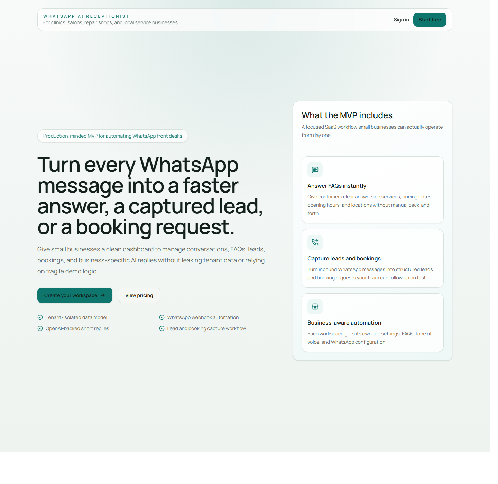
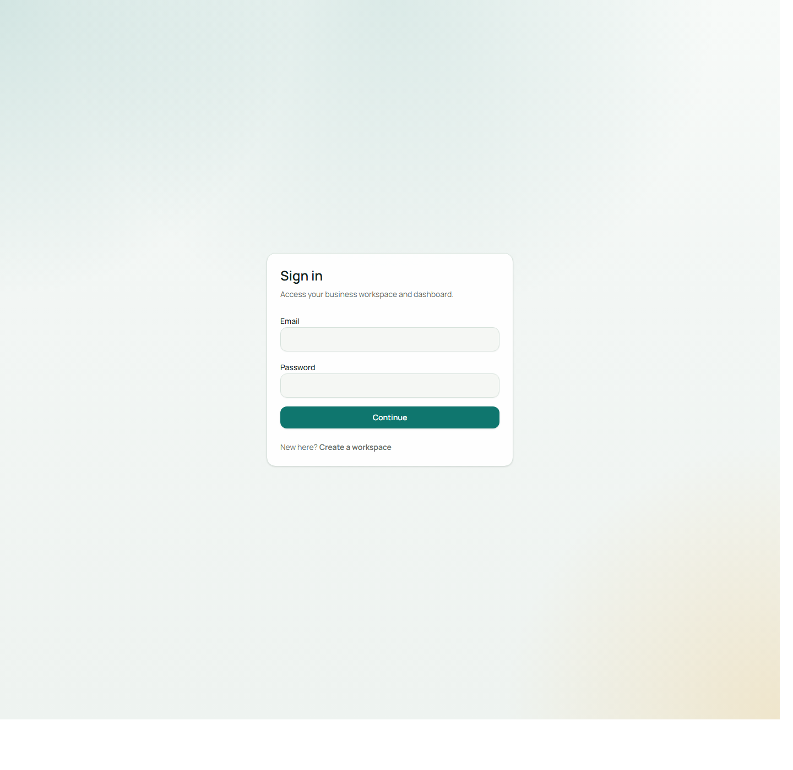
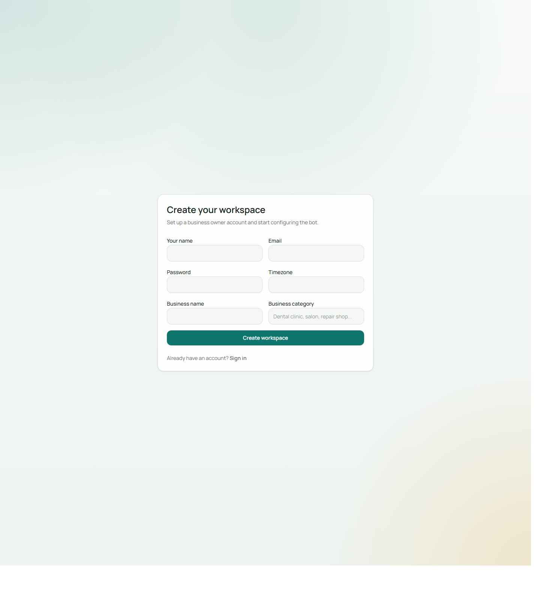

# WhatsApp AI Receptionist

Production-minded MVP for a multi-tenant SaaS that helps local businesses automate WhatsApp customer conversations for FAQs, lead capture, and booking requests.

[](https://github.com/BuildWithAbid/whatsapp-ai-receptionist/actions/workflows/ci.yml)
[](./LICENSE)
[](./CONTRIBUTING.md)

## Open Source Status

This repository is intentionally open source under the Apache License 2.0.

You can:

- use it commercially
- self-host it
- fork it
- modify it
- build products or agency offerings on top of it

You should still review the license, secure your own deployment, and comply with local privacy and messaging regulations.

## Stack

- Next.js 16 App Router
- TypeScript
- Tailwind CSS v4
- Prisma ORM + PostgreSQL
- Auth.js credentials authentication
- OpenAI API for structured AI decisions
- WhatsApp Cloud API webhook + outbound messaging
- Zod validation
- React Hook Form
- Docker

## Features

- Secure email/password sign-up and sign-in for business owners
- One workspace per business owner in the MVP
- Tenant-isolated data model using `businessId` across all owned records
- Dashboard with:
  - total conversations
  - leads captured
  - booking requests
  - unanswered / human follow-up counts
- Business settings for:
  - profile
  - bot behavior
  - WhatsApp identifiers
  - FAQ knowledge base
- WhatsApp webhook ingestion with:
  - verification handshake
  - signature verification when app secret is configured
  - idempotent inbound message storage
  - outbound reply sending
- OpenAI-powered assistant decisions with:
  - short WhatsApp-friendly responses
  - FAQ/context grounding
  - lead extraction
  - booking request extraction
  - human handoff escalation
- Basic audit-friendly logging and audit log table
- Dockerized local setup

## Community and Maintainer Docs

- [Contributing guide](./CONTRIBUTING.md)
- [Code of conduct](./CODE_OF_CONDUCT.md)
- [Security policy](./SECURITY.md)
- [Apache 2.0 license](./LICENSE)
- [Roadmap](./ROADMAP.md)
- [Demo deployment guide](./DEMO_DEPLOYMENT.md)

## Screenshots

### Landing page



### Sign-in



### Sign-up



## Architecture Summary

### Application layers

- `app/`: App Router pages and route handlers
- `components/`: UI, forms, layout, and dashboard building blocks
- `lib/auth/`: Auth.js config, session helpers, password hashing
- `lib/services/`: tenant-safe business logic orchestration
- `lib/validation/`: Zod schemas for forms, API handlers, and webhook payloads
- `lib/whatsapp/`: webhook normalization, signature verification, outbound API wrapper
- `lib/ai/`: prompt construction and AI decision generation
- `lib/logging/`: structured logger
- `prisma/`: schema and seed data

### Multi-tenant model

- Every business-owned record contains `businessId`
- All dashboard reads and mutations resolve the active business from the authenticated session
- Route handlers never accept tenant IDs from the client
- Webhook processing resolves the business from `whatsappPhoneNumberId`

### Auth model

- Auth.js credentials provider
- Passwords hashed with bcrypt
- JWT-backed sessions
- Protected workspace layout redirects unauthenticated users to `/sign-in`

## Database Models

- `User`
- `Business`
- `BotSetting`
- `FAQ`
- `Conversation`
- `Message`
- `Lead`
- `BookingRequest`
- `AuditLog`

## Webhook and AI Flow

1. Meta sends a webhook event to `POST /api/webhook/whatsapp`
2. The app optionally verifies `X-Hub-Signature-256` using `WHATSAPP_APP_SECRET`
3. The payload is normalized into inbound messages and status updates
4. The business is resolved from `metadata.phone_number_id`
5. The app de-duplicates inbound messages by external WhatsApp message ID
6. The inbound message is stored under the tenant conversation
7. Recent conversation history, business settings, and FAQs are assembled
8. The AI layer returns structured JSON:
   - `replyText`
   - `needsHumanFollowUp`
   - `leadData`
   - `bookingData`
9. Leads and booking requests are created or updated
10. If auto-reply is enabled, the app sends a WhatsApp reply and stores the outbound message
11. The conversation is marked `OPEN` or `NEEDS_HUMAN`

## Environment Variables

Copy `.env.example` to `.env` and fill in the values.

```bash
cp .env.example .env
```

Required:

- `DATABASE_URL`
- `NEXTAUTH_URL`
- `NEXTAUTH_SECRET`
- `WHATSAPP_WEBHOOK_VERIFY_TOKEN`

Optional but needed for full production behavior:

- `OPENAI_API_KEY`
- `OPENAI_MODEL`
- `WHATSAPP_ACCESS_TOKEN`
- `WHATSAPP_APP_SECRET`
- `APP_BASE_URL`
- `LOG_LEVEL`
- `RATE_LIMIT_WINDOW_MS`
- `RATE_LIMIT_MAX_AUTH_ATTEMPTS`
- `RATE_LIMIT_MAX_WEBHOOK_EVENTS`
- `SEED_OWNER_EMAIL`
- `SEED_OWNER_PASSWORD`

## Local Setup

### 1. Install dependencies

```bash
npm install
```

### 2. Start PostgreSQL

Option A: Docker

```bash
docker compose up -d postgres
```

Option B: use your own local or managed PostgreSQL instance.

### 3. Configure environment

Update `.env` with your PostgreSQL connection string and app secrets.

### 4. Generate Prisma client and apply schema

```bash
npm run prisma:generate
npm run prisma:push
```

If you prefer migrations instead of `db push`, use:

```bash
npm run prisma:migrate
```

### 5. Seed demo data

```bash
npm run prisma:seed
```

Demo credentials come from:

- `SEED_OWNER_EMAIL`
- `SEED_OWNER_PASSWORD`

### 6. Run the app

```bash
npm run dev
```

Open `http://localhost:3000`.

## WhatsApp Cloud API Setup

1. Create a Meta app and enable WhatsApp Cloud API
2. Configure your webhook callback URL:
   - `GET /api/webhook/whatsapp` for verification
   - `POST /api/webhook/whatsapp` for events
3. Set the same verification token in Meta and `WHATSAPP_WEBHOOK_VERIFY_TOKEN`
4. Add the WhatsApp `phone_number_id` and `business_account_id` in the workspace settings page
5. Provide `WHATSAPP_ACCESS_TOKEN` for outbound messages
6. Optionally configure `WHATSAPP_APP_SECRET` for signature verification

## OpenAI Setup

1. Create an OpenAI API key
2. Set `OPENAI_API_KEY`
3. Optionally override `OPENAI_MODEL`

If no OpenAI key is configured, the app falls back to deterministic FAQ and escalation logic instead of inventing answers.

## Quality Checks

Run:

```bash
npm run lint
npm run test
npm run build
```

## Docker

Build and run the whole stack:

```bash
docker compose up --build
```

The compose file expects `.env` to exist.

## Suggested Deployment Path

### Recommended

- Frontend / app runtime: Vercel
- Database: Neon, Supabase Postgres, Railway Postgres, or RDS
- WhatsApp: Meta WhatsApp Cloud API
- Secrets: Vercel environment variables

### Container-based

- Build with the included `Dockerfile`
- Deploy to Fly.io, Railway, Render, ECS, or another container platform
- Point `DATABASE_URL` at a managed PostgreSQL instance

## Open-Source Usage Notes

- The repository is open source. Hosted operations are not included.
- Do not commit real credentials, tokens, customer data, or production logs.
- If you deploy this for real businesses, you are responsible for operational hardening, backups, privacy compliance, abuse prevention, and support.
- The current in-memory rate limiter is suitable for development and small single-instance deployments, not large distributed production traffic.

## How To Help

Useful contributions include:

- stronger tests around tenant isolation and webhook flows
- queue-based processing for webhook scalability
- better observability and metrics
- richer booking workflows
- team-member support beyond the single-owner MVP model
- deployment guides for more hosting platforms

## Notes and MVP Boundaries

- One owner account per workspace
- One primary WhatsApp number per business
- Booking requests are not calendar-synced appointments
- AI escalation is the fallback when confidence is low or business data is incomplete
- Rate limiting is in-memory for MVP simplicity; distributed rate limiting should be added before high-scale multi-instance deployment

## License

Licensed under the Apache License 2.0. See [LICENSE](./LICENSE).
